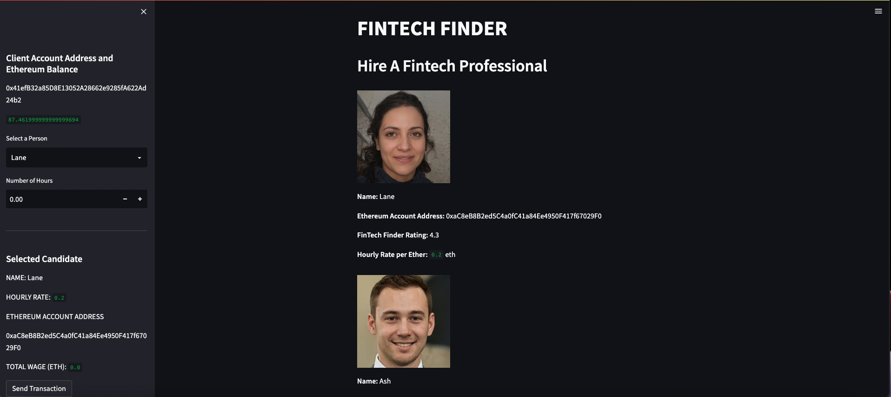
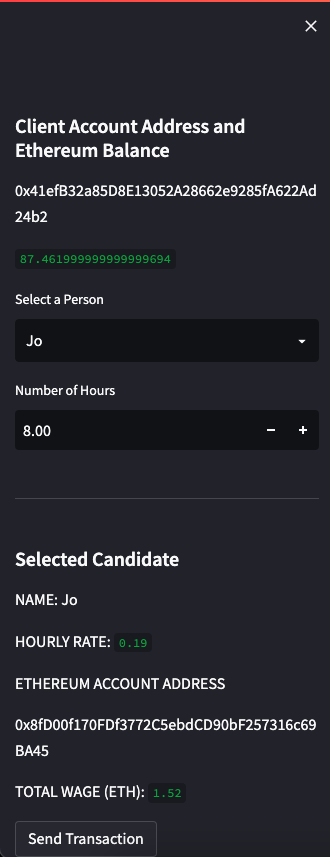
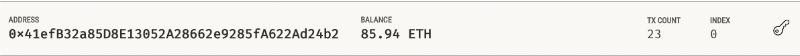
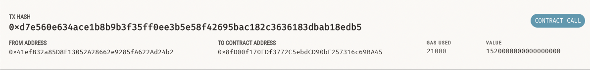

# FINTECH FINDER
FINTECH FINDER is an application that enables customers to find fintech professionals from a list of candidates, hire and pay them within an integrated service.

---

## Requirements
This application was writen in Python 3.9.7

Operating System:

* Window 10 (or higher) using Gitbash.
* MacOS 10.14 (or higher) using a terminal.
* Linux Ubuntu 22.04 (or higher) using a terminal.

Will need to be installed:

streamlit - 1.11.0
```
$ pip install streamlit
```

web3 - 5.30.0
```
$ pip install web3
```

bip44 - 0.1.1
```
$ pip install bip44
```

dotenv - 0.20.0
```
pip install python-dotenv
```

---

## Installation
To install the application you will need to clone the GitHub repository.

```
$ git clone https://github.com/yanickw/fintech_finder
```

---

## Getting Started

To get started, run the app by typing `streamlit run fintech_finder.py` from the clone directory:


Once opened in your browser you will see the app as displayed.



### *INPUT*

Start by selecting the desired **Person** and add the **Number of Hours** expected to do the task.

* **Select a Person:** Drop down menu with all the available candiates which are displayed in the main body of the app (center screen).

* **Number of Hours:** Input the number of expected hours to do the desired task. Can be manualy inputed or a "+" and "-" minus button are also available to the right side of the input area. 

The "Selected Candidate" area will automaticaly update the candidate's **Name**, **Hourly Rate**, **Ethereum Wallet Address** and the **Total Wage**.

* **Name:** Displays the selected candidate `Name`.

* **Hourly Rate:** Displays the selected candidate `Hourly Rate`.

* **Ethereum Wallet Address:** Displays the selected candidate `Ethereum Wallet Address`.

* **Total Wage**: Display the `Total Wage` value in ETH.



### *SENDING TRANSACTION*
First verify all the information displayed in the `Selected Candidate` section.

Then select the `Send Transaction` button. 

This will automaticaly trigger and complete the transaction between the `user` and the `Selected Candidate`.

### *INSPECT THE TRANSACTION*

To confirm that the transaction was completed, go to your account on the blockchain it was completed (*for this example we used Ganache*) and look at your account wallet as displayed here. 



You can also verify the transaction `transaction hash`, `from address`, `to contract address`, `gas used` and `value` in the transaction tab.



---

## Contributors
This application originated from a Berkeley Bootcamp.

For any inquieries, feedbacks or comments about this project please email me at  [yanickw@gmail.com](mailto:yanickw@gmail.com)

I can also be reached on  [LinkedIn](https://www.linkedin.com/in/yanickwilisky/)  or  [Twitter](https://twitter.com/yanickwilisky).

---

## License

MIT License

Copyright (c) 2022 Yanick Wilisky

Permission is hereby granted, free of charge, to any person obtaining a copy of this software and associated documentation files (the "Software"), to deal in the Software without restriction, including without limitation the rights to use, copy, modify, merge, publish, distribute, sublicense, and/or sell copies of the Software, and to permit persons to whom the Software is furnished to do so, subject to the following conditions:

The above copyright notice and this permission notice shall be included in all copies or substantial portions of the Software.

THE SOFTWARE IS PROVIDED "AS IS", WITHOUT WARRANTY OF ANY KIND, EXPRESS OR IMPLIED, INCLUDING BUT NOT LIMITED TO THE WARRANTIES OF MERCHANTABILITY, FITNESS FOR A PARTICULAR PURPOSE AND NONINFRINGEMENT. IN NO EVENT SHALL THE AUTHORS OR COPYRIGHT HOLDERS BE LIABLE FOR ANY CLAIM, DAMAGES OR OTHER LIABILITY, WHETHER IN AN ACTION OF CONTRACT, TORT OR OTHERWISE, ARISING FROM, OUT OF OR IN CONNECTION WITH THE SOFTWARE OR THE USE OR OTHER DEALINGS IN THE SOFTWARE.
